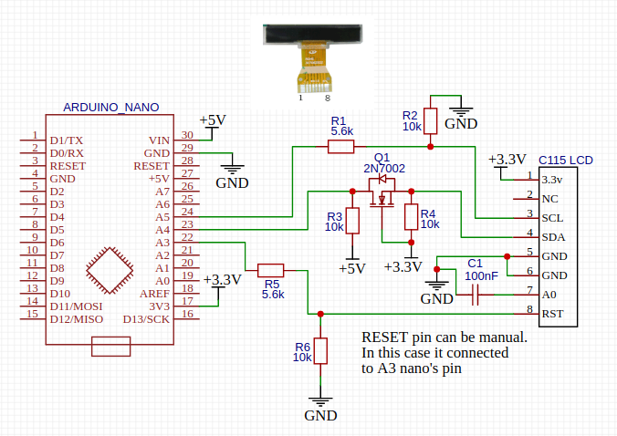
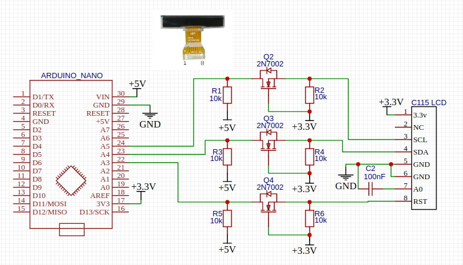

# ST7558 I2C LCD LIBRARY

This is an arduino library for monochrome LCD based on ST7558 driver. This library provides just hardware application layer functions. Most graphic features are provided by Adafruit GFX library.

## Overview

ST7558 supports I²C, SPI or 8-bit parallel interface (8080 and 6800) to communicate. 
I²C requires 2 pins (SCL and SDA) and RESET pin. SPI requires 4 pins and RESET pin.
My LCD version doesn't have SPI and 8-bit parallel interface outputs, only I²C.

Display from the phone Motorola C115 also included in:
    
    Motorola C113/C115/C116/C118/C123

#### ST7558:

    - resolution: 102x66, but version from the phone Motorola C115 has 96x65 visible pixels
    - on-chip display data RAM (102x66 = 6732 bit)
    - I²C address: 0x3C
    - pinout:
                                ________________________
           1 Vcc +3.3v         / ______________________ \
           2 none             | |                      | |
           3 I²C SDA          | | ST7558 LCD from C115 | |
           4 I²C SCL          | |                      | |
           5 A0               | |        96x65         | |
           6 GND              | |______________________| |
           7 VLCD              \________________________/
           8 RESET               |  |  |  |  |  |  |  |
           .......               1  2  3  4  5  6  7  8

## How to use it

ST7558 library depends by Adafruit GFX library and you must install Adafruit GFX for your IDE.

If you use Arduino IDE add ST7558, Adafruit GFX and Adafruit BusIO libraries via "Sketch -> Include Library -> Add .ZIP Library" in Arduino IDE.\
If you use Platformio IDE just add the following text in your platformio.ini:

    lib_deps=
        https://github.com/adafruit/Adafruit_BusIO
        https://github.com/kashapovd/Motorola-LCD-ST7558-library
        https://github.com/adafruit/Adafruit-GFX-Library

## How to connect

Possible connection shown in this picture. C115's inputs are 3.3v tolerant
\
\

\
or like this
\
 
\
but, in my case, I always do the direct connection :)

## Demonstration ([video](https://youtu.be/PMxQ5Tmf7f8))

Kashapov Yaroslav, 2020\
feedback: [telegram](https://t.me/kashapovd), <iam@kashapovd.xyz>
